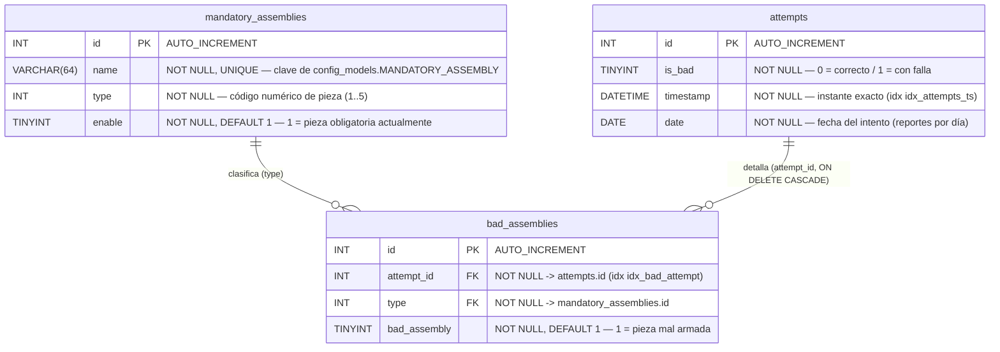

# Esquema de la base de datos — Hollymatic Vision System (HVS)

Base de datos **MySQL 8 / InnoDB**, charset `utf8mb4`. El esquema se hornea en la
imagen y lo ejecuta la imagen oficial de MySQL al inicializar un volumen de datos
**vacío** (`/docker-entrypoint-initdb.d/`). Fuente de verdad:
[`db/init/01_schema.sql`](init/01_schema.sql).

> ⚠️ El script **no** se re-ejecuta si el volumen `db_data` ya contiene datos.
> Para reaplicar el esquema hay que borrar el volumen.

Modelo normalizado en 3 tablas:

| Tabla | Propósito |
|-------|-----------|
| `mandatory_assemblies` | Catálogo de las 5 piezas obligatorias. |
| `attempts` | Un registro por cada corrida de `turn_on_button`. |
| `bad_assemblies` | Una fila por cada pieza mal armada dentro de un intento. |

---

## Diagrama entidad–relación

### Cardinalidad

- **`attempts` 1 — N `bad_assemblies`**: un intento puede tener de 0 a N piezas
  mal armadas. Al borrar un intento se borran sus filas hijas
  (`ON DELETE CASCADE`).
- **`mandatory_assemblies` 1 — N `bad_assemblies`**: cada fila de fallo apunta al
  catálogo de la pieza involucrada. Sin `CASCADE` (borrado restringido por defecto).

---

## Detalle por tabla

### `mandatory_assemblies` — catálogo de piezas obligatorias

| Columna | Tipo | Restricciones | Descripción |
|---------|------|---------------|-------------|
| `id`     | `INT`         | PK, `AUTO_INCREMENT` | Identificador interno. |
| `name`   | `VARCHAR(64)` | `NOT NULL`, `UNIQUE`  | Clave de `config_models.MANDATORY_ASSEMBLY`. |
| `type`   | `INT`         | `NOT NULL`            | Código numérico de la pieza (1..5). |
| `enable` | `TINYINT`     | `NOT NULL`, `DEFAULT 1` | `1` = pieza obligatoria actualmente. |

> Los `name` **deben** coincidir exactamente con las claves de
> `config_models.MANDATORY_ASSEMBLY` (`app/src/configs/configmodels.py`) para que
> el repositorio mapee `name -> id`.

**Datos semilla** (`INSERT ... ON DUPLICATE KEY UPDATE`):

| id | name | type | enable |
|----|------|------|--------|
| 1 | `RAM_ASSEMBLY_AND_DRIVE_BAR` | 1 | 1 |
| 2 | `LOCK_SHAFT_ASSAMBLY`        | 2 | 1 |
| 3 | `KOCUP_KOARM_AND_MOLDPLATE`  | 3 | 1 |
| 4 | `ECCENTRIC_LEVER`            | 4 | 1 |
| 5 | `TUMBLER`                    | 5 | 1 |

### `attempts` — intentos de armado

| Columna | Tipo | Restricciones | Descripción |
|---------|------|---------------|-------------|
| `id`        | `INT`      | PK, `AUTO_INCREMENT` | Identificador del intento. |
| `is_bad`    | `TINYINT`  | `NOT NULL`           | `0` = armado correcto / `1` = con falla. |
| `timestamp` | `DATETIME` | `NOT NULL`           | Instante exacto del intento. |
| `date`      | `DATE`     | `NOT NULL`           | Fecha del intento (reportes por día). |

**Índices:** `idx_attempts_ts (timestamp)`.

### `bad_assemblies` — piezas mal armadas por intento

| Columna | Tipo | Restricciones | Descripción |
|---------|------|---------------|-------------|
| `id`           | `INT`     | PK, `AUTO_INCREMENT`      | Identificador de la fila de fallo. |
| `attempt_id`   | `INT`     | `NOT NULL`, FK → `attempts.id` `ON DELETE CASCADE` | Intento al que pertenece. |
| `type`         | `INT`     | `NOT NULL`, FK → `mandatory_assemblies.id` | Pieza involucrada. |
| `bad_assembly` | `TINYINT` | `NOT NULL`, `DEFAULT 1`   | `1` = esta pieza salió mal armada. |

**Índices:** `idx_bad_attempt (attempt_id)`.
**Claves foráneas:** `fk_bad_attempt` (→ `attempts`), `fk_bad_type` (→ `mandatory_assemblies`).

---

## Notas de implementación

- Modelos ORM (SQLAlchemy) que **mapean** este esquema (no lo crean), duplicados
  entre los contenedores `app` y `scheduler`:
  [`app/src/db/models.py`](../app/src/db/models.py),
  `scheduler/src/db/models.py`.
- El contenedor `db` (`HVS-DB`) es **interno** a la red de Docker; no publica el
  puerto al host. El resto de servicios lo alcanzan con `DB_HOST=db`, `DB_PORT=3306`.
